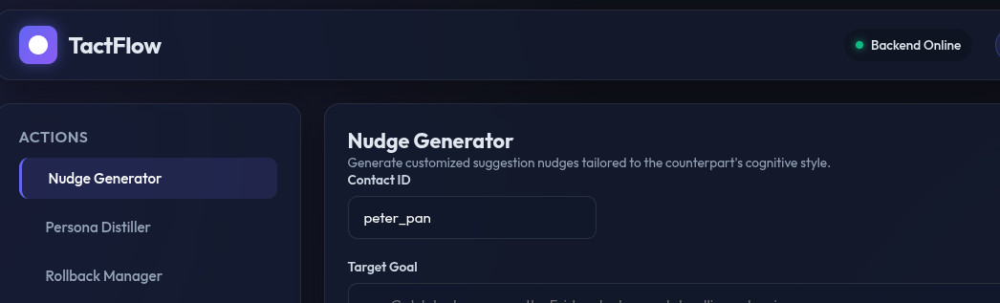
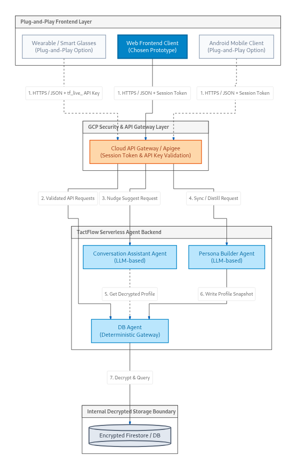
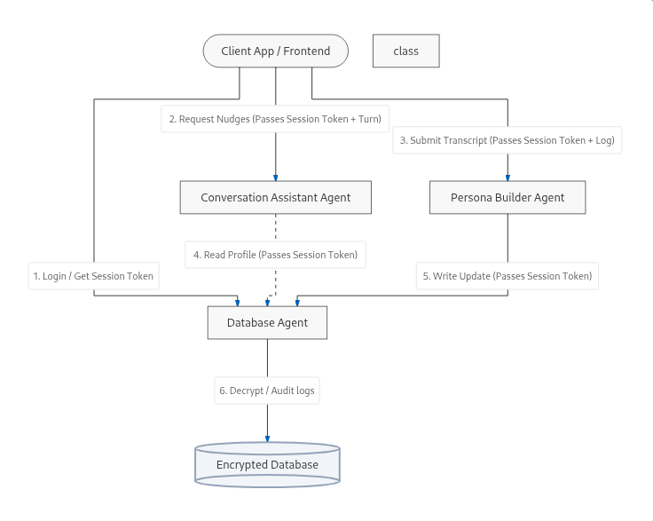
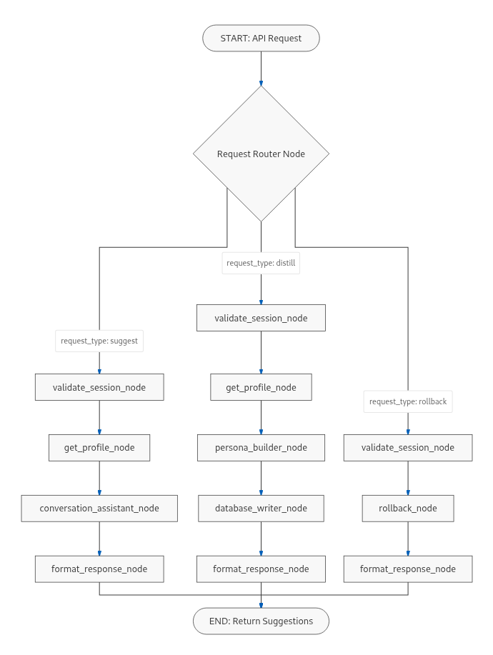
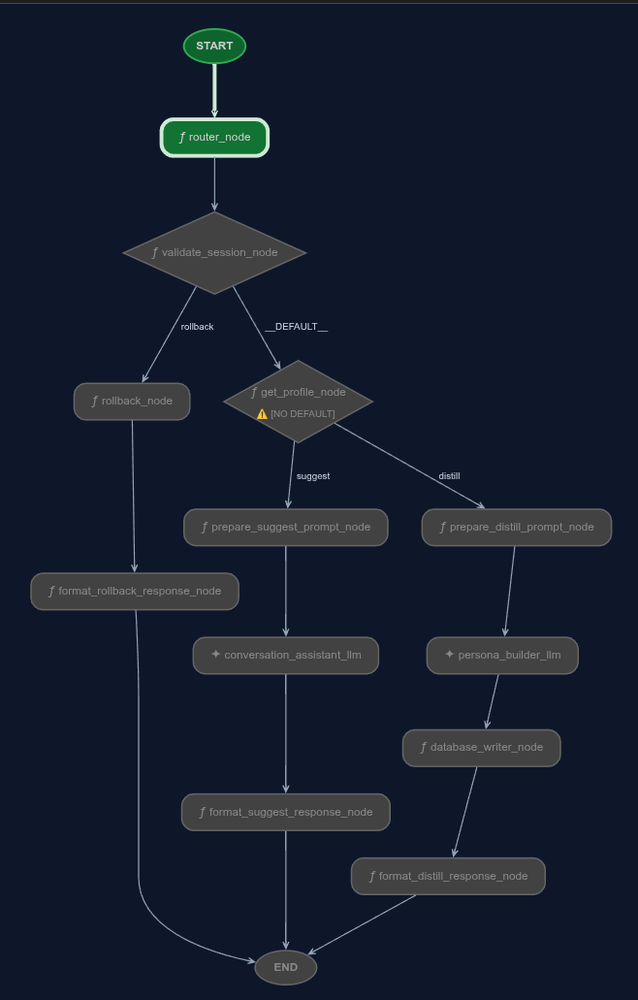
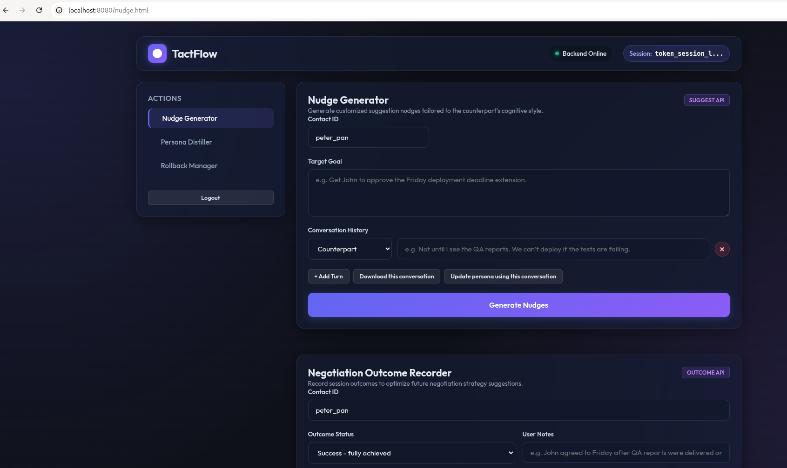

# TactFlow

An AI agent for conversational suggestions for negotiation and nudging with counterparty profiling

# Introduction
There are many situations where people have responsibility of (a project) deliverable while not having authority to enforce any decision. eg. Industry bodies like Bluetooth SiG, or the 3GPP. Nudge and negotiation are the only options to get to a consensus fast. Many technical professionals lack such 'people skills'. This platform helps a user build a temperament profile of their peers, and use that profile to advance discussions.

An ADK2.0 Agentic graph workflow is the **core engine**. The interface to the **core engine** is well defined set of JSON schemas. We can plug a Web or Android App or Wearable(eg. glasses) frontend to the **core engine**. For demo we plug-in a Web Front-end.

# Methodology
Followed a Spec Driven Development (SDD) workflow. The spec refinement happening in a traditional waterfall model in two phases - Concept and Detailed Design.

## Concept Phase
Antigravity was prompted to come up with a comprehensive business plan for the idea of a "nudge cum negotiation tool". Competitive landscape and customer profiles were created and the idea was found to have a potential unique selling point (USP) that no other existing tools cater to. Then literature search was done to identify orthogonal traits of human behaviour with help of Antigravity. Also a system architecture and rough interface spec were generated using Antigravity. The agent came up with the following architecture: 

So output of this stage were
* business_plan.md
* persona_identification.md
* system_arch.md
* interface_spec.md

## Detailed Design Phase
A fresh antigravity context (new project, new conversation) was created where the agent referenced only the outputs from previous phase (To better avoid context rot).This stage referenced the output .md files from the previous stage. Implementation constraints like low latency, cost etc. were considered. Also mapped agents to deterministic behaviour vs llmAgents. Implementation framework was also introduced at this stage. Interface specs were refined to meet the reality. A detailed_design was created, requirements were captured and reviewed. And test_plan and implementation plan were created and refined. The agent came up with following design: 

The outputs were
* detailed_design.md
* requirements.md
* development_plan.md
* test_plan.md
* threat_model.md (STRIDE Threat Model review of the detailed_design.md and requirements.md created in this phase)

## Guard Rails
The entire development flow was version controlled using local git repository, for easy rollback from hallucinations if any.
A fresh antigravity conversation was used to setup the CONTEXT.md, .agents folder, pre-tool use hooks. In addition to the standard 'rm -rf /' guradrail that we learned during codelabs, All commands that remove commit history in git were also forbidden.

## Implementation
A fresh antigravity context (new conversation) was created where the agent referenced only the outputs from Detailed Design phase. The agent was asked to scaffold the agents-cli project. Antigravity agent was then instructed to implement each step in a Test Driven Development (TDD) fashion.

The agent ensure in phase 1 that unit tests were all passing. In Phase 2 it ensured integration tests are passing. Phase 3 was full system test with mock keys. Phase 4 with LLM-as-Judge evaluation.

The implemented flow graph: 

## Test & Results
Once the automated tests and implementation have all completed, the agent was asked to bring a playground up and also was instructed to design a web page that collects/presents the information required for the agent in a human readable form and converts to a JSON format required by the agent. Manual tests were done for functionality. Minor late-stage requirement changes were prompted to antigravity agent and were accomplished. Screenshot of the web frontend:

## Conclusion
As we adopted a Spec Driven Development, the main agent was mostly first time right (I don't remember any single change that i had to vibe code after the standard implementation). But the web interface was a late thought and was vibecoded with a lot of back-and-forth with the agent. So the project gave an exact sense of Agentic Engineering vs Vibe Coding. Strict guardrails like pre tool execution hooks with local git repo gives peace of mind against potential hallucinations.