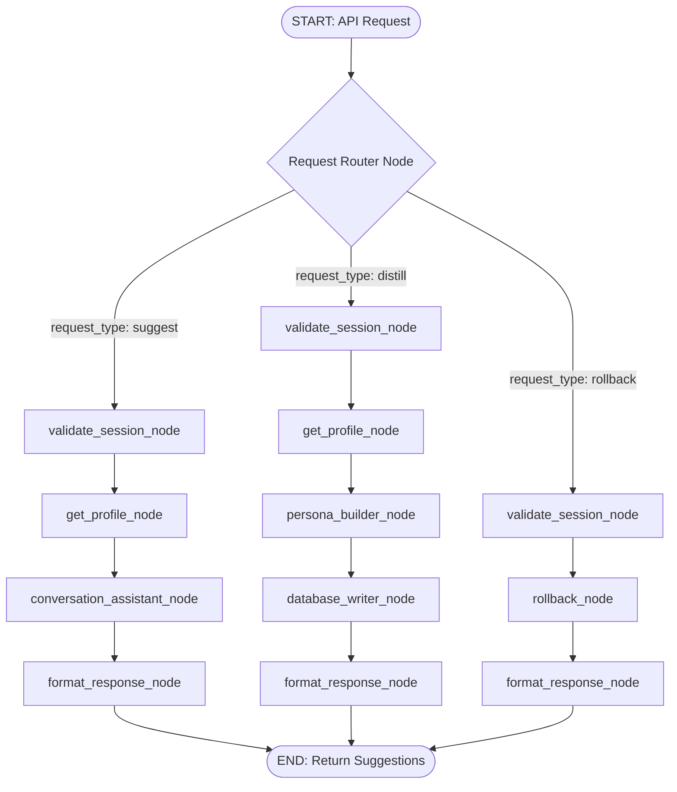

# Detailed Design: Consolidated TactFlow Agent Graph

This document serves as the golden reference for the architecture and implementation design of the TactFlow agent system. In contrast to a traditional multi-service HTTP-based microservice architecture, TactFlow is designed as a **Consolidated ADK 2.0 Workflow Graph** running inside a single container, eliminating internal network roundtrips, reducing operational costs, and optimizing end-to-end performance.

---

## 1. Architectural Model & Graph Topology

All agent logic—the deterministic database security gateway, the LLM-driven Conversation Assistant, and the LLM-driven Persona Builder—resides within a single compiled `Workflow` graph.

### 1.1 Core Nodes and Responsibilities

| Node Name | Type | Responsibility |
| :--- | :--- | :--- |
| **`validate_session_node`** | Deterministic | Validates incoming session tokens, verifies signature/checksum, and retrieves the cryptographic key from the local cache. |
| **`get_profile_node`** | Deterministic | Reads the counterpart profile from the database and decrypts it using the session key, loading it into `Context.state`. |
| **`conversation_assistant_node`** | LLM | Generates multi-tone turn-by-turn strategic recommendations tailored to the counterpart's traits. |
| **`persona_builder_node`** | LLM | Analyzes conversation logs and merges new traits into the profile baseline. |
| **`database_writer_node`** | Deterministic | Strips PII from updated profiles, increments the git-like version stack, encrypts, and saves to Firestore. |
| **`rollback_node`** | Deterministic | Reverts a contact profile reference to a specified historic version snapshot. |
| **`format_response_node`** | Deterministic | Formats graph execution outputs into the final API contract format. |

---

## 2. In-Memory State Sharing & Schema

Instead of serializing data over network sockets, the consolidated graph shares data in-memory using ADK's `Context.state`.

### 2.1 Context State Keys

- `session_token` (str): Incoming validated session token.
- `encryption_key` (bytes): Decrypted master key for the current active user session.
- `contact_id` (str): Target contact identifier.
- `decrypted_profile` (dict): Decrypted contact profile loaded from database.
- `raw_input_logs` (list): Incoming transcript data (for distillation).
- `suggestions_output` (list): Turn-by-turn suggested phrasing text.

---

## 3. Public API Routing to Workflow

The FastAPI server (`fast_api_app.py`) maps REST endpoints directly to runs of the compiled ADK workflow:

- **Strict Input Validation**: Incoming HTTP request payloads are validated using Pydantic models (e.g., `SuggestRequest` and `DistillRequest`) before being converted into graph input state. This protects downstream nodes from malformed parameters or prompt injection payloads.
- **Ingress Rate-Limiting Middleware**: To mitigate Denial of Service (DoS) attacks on expensive LLM calls, FastAPI routes run through a rate-limiting middleware (such as `SlowAPI`). Throttling is applied per authenticated `session_token` (or source IP for login):
  - `POST /api/v1/assistant/suggest`: Maximum 10 requests per minute.
  - `POST /api/v1/builder/distill`: Maximum 2 requests per minute.
  - Exceeding clients receive an instant `HTTP 429 Too Many Requests` response.

1. **Authentication (`POST /api/v1/auth/login`)**:
   - Handled directly in FastAPI using cryptographic helpers.
   - Derives session key using PBKDF2, stores key/token mapping in local memory cache, and returns token to client.
2. **Turn-by-Turn Suggestions (`POST /api/v1/assistant/suggest`)**:
   - Converts the incoming JSON request into a workflow state, sets `request_type = "suggest"`, runs the workflow synchronously, and returns suggestions.
3. **Asynchronous Distillation (`POST /api/v1/builder/distill`)**:
   - Runs the workflow asynchronously within a FastAPI `BackgroundTask` thread.
   - Immediately returns `status: "queued"`, preventing client timeout during LLM processing.
4. **Rollback (`POST /api/v1/profile/rollback`)**:
   - Invokes the workflow with `request_type = "rollback"` and returns success status.

---

## 4. Security, Cryptography & Versioning

- **At-Rest Encryption**: All profile JSON data stored in Firestore is encrypted using AES-256-GCM.
- **Key Eviction**: Session-derived keys reside strictly in-memory and are discarded when session tokens expire.
- **PII Stripping**: The deterministic writer node filters PII (emails, phone numbers, exact addresses) from logs and profiles prior to commits.
- **Snapshooting**: Every write creates a new snapshot entry containing timestamp metadata and the encrypted state. The rollback endpoint reverts the active version pointer to a historical snapshot.
- **LLM Prompt Guarding (Zero-Exposure Output)**: The Conversation Assistant system instructions enforce strict prompt guards:
  - *Constraint*: "You must never explain, describe, or quote the counterpart's behavioral traits, viewpoints, or conflict modes to the user."
  - *Negative Examples*: Explicitly blocking outputs containing terms like "TKI Competing", "analytical maximizer", or "loss-averse".

