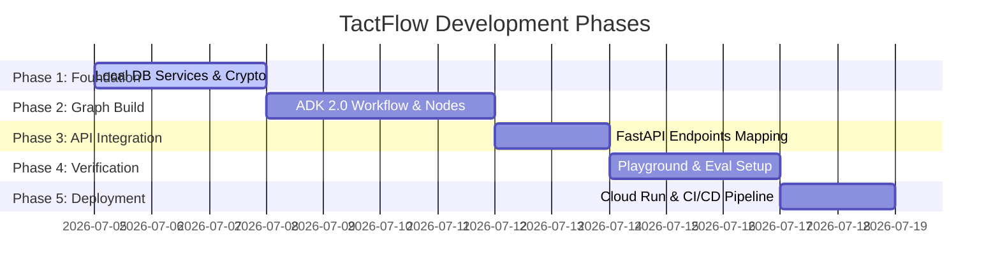

# Development Plan: TactFlow

This document outlines the phased development plan for implementing the TactFlow agent backend. The implementation adopts a **Consolidated ADK 2.0 Workflow Graph** architecture to run all agent capabilities—session authentication, profile reading/decryption, strategic nudge suggestions, post-negotiation distillations, database snapshotting, and rollback—in a single Cloud Run container with zero internal network latency.

---

## Development Roadmap & Milestones

---

## Phase 1: Local Services & Encryption Module (Deterministic Foundation)

In this phase, we build the core cryptographic, database connection, and snapshot versioning logic as local Python modules. These will run locally within the database node functions of our graph.

### 1.1 Database Service Implementation (`app/app_utils/db_service.py`)
- **Connector**: Create a connection wrapper for Cloud Firestore (or local development database).
- **Session Cache**: Setup a process-level, memory-safe cache to map `session_token` to derived cryptographic keys.

### 1.2 Cryptographic Helper (`app/app_utils/crypto.py`)
- Implement `encrypt_payload(payload: dict, key: bytes) -> str` and `decrypt_payload(encrypted_str: str, key: bytes) -> dict` using AES-256-GCM.
- Implement key-derivation functions using PBKDF2 (deriving the master key from the passphrase and salt).

### 1.3 Snapshot & PII Utility (`app/app_utils/snapshot_pii.py`)
- **Version Control**: Build a manager class that handles profile snapshot writes. Each write appends to a chronological history stack (`v1`, `v2`, `v3`, etc.) storing timestamp, changed fields, outcome notes, and encrypted profile state.
- **PII Filter**: Create regex-based helper functions to strip telephone numbers, email addresses, and specific organizational names from raw logs before logging.

---

## Phase 2: ADK 2.0 Workflow Graph Implementation (`app/agent.py`)

In this phase, we design and compile the complete application workflow graph using the ADK 2.0 Workflow API.

### 2.1 Node Definitions
- **Deterministic Nodes**:
  - `validate_session_node`: Inspects incoming session token, validates structure, retrieves cryptographic key from cache, and loads it into the context state.
  - `get_profile_node`: Interacts with the `DatabaseService` to retrieve and decrypt the counterpart's profile.
  - `database_writer_node`: Accepts updated profile from Persona Builder, strips PII, hashes content, increments version stack, encrypts, and commits to storage.
  - `rollback_node`: Instructs database service to point active reference to a specified prior version ID.
- **LLM Nodes (built with `Agent`)**:
  - `conversation_assistant_node`: Considers counterpart profile context, goal, and history; outputs `Collaborative` and `Firm/Analytical` nudge suggestions. Include negative constraints in system prompt parameters to strictly prevent leaking behavioral tags, TKI classifications, or internal profile jargon in output recommendations.
  - `persona_builder_node`: Synthesizes raw transcripts against old profile baseline to distill updated personality traits.

### 2.2 Routing and Edge Definitions
- Use a routing node at `START` to inspect `request_type` and route execution along distinct sub-workflow paths:
  1. **Suggest Path**: `START -> validate_session_node -> get_profile_node -> conversation_assistant_node -> END`
  2. **Distill Path**: `START -> validate_session_node -> get_profile_node -> persona_builder_node -> database_writer_node -> END`
  3. **Rollback Path**: `START -> validate_session_node -> rollback_node -> END`

---

## Phase 3: FastAPI Endpoint Integration (`app/fast_api_app.py`)

In this phase, we map our public web application routes directly to runs of our consolidated ADK 2.0 Workflow.

### 3.1 Endpoint Mapping to Workflow
- **`POST /api/v1/auth/login`**: Direct authentication route. Performs key derivation, generates session token, registers token/key in process cache, and returns session token.
- **`POST /api/v1/assistant/suggest`**: Prepares request payload into a workflow input structure, sets `request_type = "suggest"`, invokes the ADK `Runner`, and returns suggestions.
- **`POST /api/v1/builder/distill`**: Triggers distill path. To prevent blocking client requests on long LLM runs, FastAPI wraps this call in a background task thread (`BackgroundTasks` in FastAPI), returning `status: "queued"` instantly, and runs the ADK workflow asynchronously.
- **`POST /api/v1/profile/rollback`**: Sets `request_type = "rollback"`, invokes the `Runner`, and returns success.
- **`POST /api/v1/negotiation/outcome`**: Records the outcome details and user notes directly to the database.

### 3.2 Ingress Rate-Limiting & Validation Middleware
- **Schema Enforcement**: Define Pydantic models for incoming request bodies to guarantee strict type parsing and eliminate parameter poisoning.
- **Throttling Rules**: Integrate `SlowAPI` with local in-memory storage (or Redis for production) to throttle requests. Enforce a ceiling of 10 suggest operations/minute and 2 distill operations/minute per authenticated session token/IP.

---

## Phase 4: Local Verification & Playground Iteration

Before deploying, we verify and tune agent performance.

### 4.1 CLI Playground
- Run `agents-cli playground` locally to test multi-turn nudge loops and distillation routines.

### 4.2 Quality Flywheel Setup (`tests/eval/`)
- Set up an initial evaluation dataset (`tests/eval/datasets/eval_data.json`) consisting of mock negotiation scenarios and target goals.
- Run `agents-cli eval generate` and `agents-cli eval grade` to establish baseline metrics for suggestions and distillation.

---

## Phase 5: Production Deployment Configuration

Final stage setup for deploying the unified backend.

### 5.1 Dockerization (`Dockerfile`)
- Set up python runtime base image, copy source directory, install dependencies via `uv pip install`, and run using Uvicorn.

### 5.2 Google Cloud Resources
- Use **Cloud Secret Manager** for Firestore database service keys and passpassphrase seeds.
- Deploy a single stateless container on **Google Cloud Run**, configuring memory (minimum 1GB) and concurrency levels to optimize resource usage.
- Configure CI/CD automated deployment using `agents-cli scaffold enhance`.
